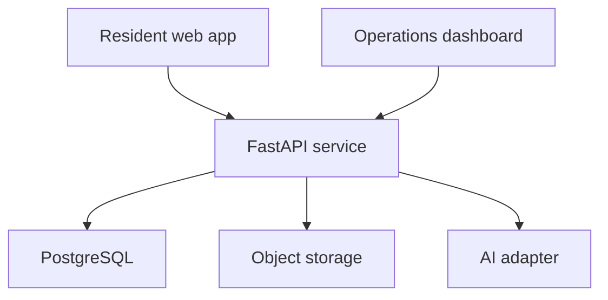
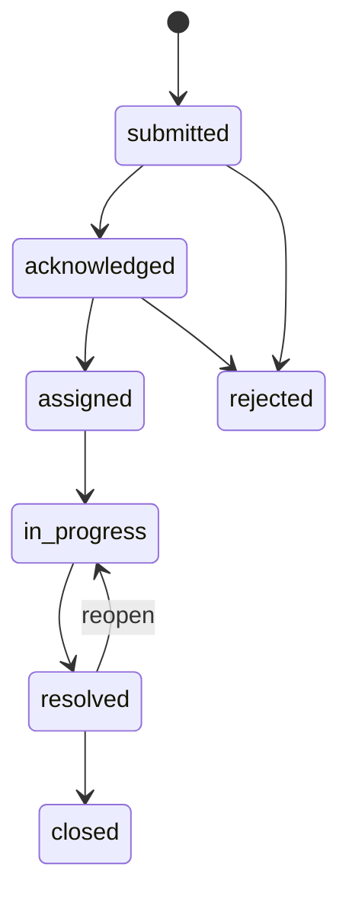

# System Architecture

## Context

## Responsibilities

| Component | Responsibility |
|---|---|
| Next.js web application | Accessible UI, session handling, report flow, dashboard views |
| FastAPI service | Validation, authorisation, workflow rules, API responses, AI orchestration |
| PostgreSQL | Authoritative transactional data, history, assignments, audit records |
| Object storage | Private evidence images accessed through short-lived signed URLs |
| AI adapter | Vendor-independent prompt construction and schema-valid response parsing |

## Trust boundaries

1. Browser input is always untrusted.
2. Authentication proves identity; server-side policies determine permission.
3. AI output is untrusted data and must pass the same validation as user input.
4. Object storage is private by default.
5. Analytics queries must respect role and department scope.

## Domain modules

- `identity`: profiles, roles, and department membership
- `incidents`: drafts, reports, locations, and evidence
- `workflow`: assignments, transitions, updates, and history
- `triage`: AI conversations, structured suggestions, and human confirmation
- `analytics`: authorised aggregate queries
- `audit`: privileged action records

## Incident state machine

All transitions are enforced by backend policy. Status history is append-only.

## Deployment plan

- Frontend: Vercel-compatible Next.js deployment
- Backend: containerised FastAPI deployment
- Database/auth/storage: Supabase project
- Environments: local, preview, and production with separate credentials
- Secrets: platform secret stores only; never committed to Git

## Architectural decisions

### Modular monolith first

The MVP uses one backend service with explicit domain modules. This is simpler to test and deploy than microservices while preserving boundaries that could later be separated.

### Human confirmation before submission

The AI may propose category and urgency but cannot create a final incident without a confirmed request. This prevents conversational mistakes from becoming operational records.

### PostgreSQL as the source of truth

AI conversation state supports the workflow but never replaces validated incident records. Analytics and audit history are derived from transactional data.

### Provider-independent AI boundary

The application depends on an internal structured-output interface, not directly on a vendor SDK. Provider implementations can be swapped without changing incident-domain logic.
